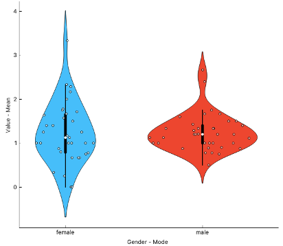
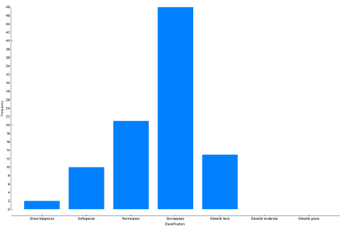

# Custom Orange widgets for loading and analysing FHIR healthcare data

A Python project that extends the [Orange](https://orangedatamining.com/) data mining platform with custom widgets for extracting, processing, and visualising **FHIR (Fast Healthcare Interoperability Resources)** data. Synthetic patient records generated by [Synthea](https://synthea.mitre.org/) are used as input.

---

## 🖼️ Visuals

### Workflow 1 — EDA Patient Resource


> Descriptive analysis of the Patient resource: relationship between QALY and DALY values by marital status and age.

### Workflow 2 — PHQ-2 and Tobacco Smoking Status


> Distribution of PHQ-2 and Tobacco Smoking Status NHIS survey results by gender.

### Workflow 3 — BMI Classification


> Classification of patients by BMI category and frequency distribution across the sample.

---

## 📋 Overview

The project aims to simplify access to FHIR-structured clinical data within the Orange visual programming environment. By building custom Python widgets, it enables healthcare professionals and researchers to:

- **Load** FHIR resources directly from Synthea-generated JSON files.
- **Extract** relevant clinical fields from Patient and Observation resources.
- **Transform** raw FHIR data into Orange-compatible Data Tables.
- **Analyse and visualise** the data through Orange's built-in tools across three analytical workflows.

---

## 📂 Repository Structure

```
FHIRresources_Orange/
├── fhirCaricamento.py          # Widget: load FHIR resources from JSON files
├── FHIRinputPatient.py         # Widget: extract and table Patient resource fields
├── FHIRinputObservation.py     # Widget: extract and table Observation resource fields
├── setup.py                    # Package setup for Orange widget integration
├── __init__.py                 # Package initialisation
├── WORKFLOW 1.ows              # Orange workflow: EDA on Patient resource
├── WORKFLOW 2.ows              # Orange workflow: PHQ-2 & Tobacco Smoking Status
├── WORKFLOW 3.ows              # Orange workflow: BMI classification
├── assets/                     # Screenshots of workflow results
├── docs/
│   └── fhir_resources.md       # Description of FHIR resources used
├── data/
│   └── README.md               # Instructions for obtaining Synthea JSON data
└── Analisi dati FHIR in Orange.docx   # Full project documentation (Italian)
```

---

## 📦 Dependencies

- [Orange3](https://orangedatamining.com/) — visual data mining platform
- [fhirclient](https://github.com/smart-on-fhir/client-py) — Python FHIR client library
- Python ≥ 3.8

Install the required Python packages:

```bash
pip install orange3 fhirclient
```

---

## 🚀 Installation & Usage

### 1. Clone the repository

```bash
git clone https://github.com/marinoalfonso/FHIRresources_Orange.git
cd FHIRresources_Orange
```

### 2. Obtain synthetic patient data

Download free synthetic patient records from [Synthea](https://synthea.mitre.org/downloads). The JSON files in FHIR R4 format are used as input for the widgets. See [`data/README.md`](data/README.md) for details.

### 3. Install the widgets into Orange

Run the following command in the same Python environment where Orange is installed:

```bash
pip install .
```

This executes `setup.py` and registers the custom widgets in Orange. For a detailed walkthrough, refer to the [Orange widget development guide](https://orange3.readthedocs.io/projects/orange-development/en/latest/tutorial.html).

### 4. Open a workflow

Launch Orange, open one of the `.ows` workflow files, and connect the FHIR input widgets to your downloaded JSON files.

---

## 🔬 Workflows

| Workflow | File | Description |
|---|---|---|
| EDA Patient Resource | `WORKFLOW 1.ows` | Descriptive analysis of Patient demographics; QALY vs DALY by marital status and age |
| Survey Analysis | `WORKFLOW 2.ows` | PHQ-2 depression screening and Tobacco Smoking Status NHIS survey results by gender |
| BMI Classification | `WORKFLOW 3.ows` | BMI calculation and patient classification by WHO category |

---

## 🏥 FHIR Resources

This project works with two FHIR R4 resources:

- **Patient** — demographic and administrative information about a patient.
- **Observation** — measurements and clinical findings (BMI, survey scores, smoking status).

For a detailed description of the fields extracted from each resource, see [`docs/fhir_resources.md`](docs/fhir_resources.md).

---

## 👤 Author

**Alfonso Marino**
[GitHub](https://github.com/marinoalfonso) · Feel free to open an issue or submit a PR.

---

## 📄 License

This project is licensed under the [MIT License](LICENSE).
